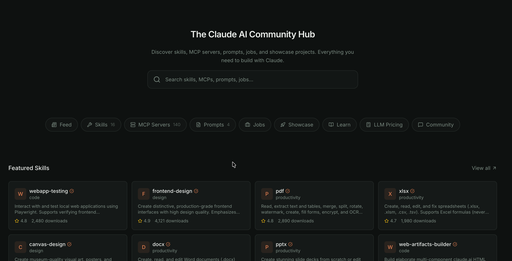

# Claude Collective Frontend

Discover skills, MCP servers, prompts, jobs, and showcase projects. Everything you need to build with Claude.



## Getting Started

### Prerequisites

Ensure you have Node.js 18.17.0+ installed. This project uses `npm` for package management.


### Running Development Server

To start the development server:

```bash
npm run dev
```

Open [http://localhost:3000](http://localhost:3000) with your browser to see the result.

## Tech Stack & Features

-   **Framework**: [Next.js 15](https://nextjs.org/) (App Router, Server Actions)
-   **Styling**: [Tailwind CSS v4](https://tailwindcss.com/)
-   **UI Library**: [Radix UI](https://www.radix-ui.com/) primitives
-   **Components**: Based on [shadcn/ui](https://ui.shadcn.com/) patterns
-   **Icons**: [Lucide React](https://lucide.dev/)
-   **State Management**: React Query (TanStack Query) / Context API
-   **Forms**: React Hook Form + Zod validation

## Claude AI Directory Features

- **MCP Servers Directory**: Discover and share Model Context Protocol servers to extend Claude's capabilities.
- **Prompts Library**: A collection of optimized system prompts and user prompts for various use cases.
- **Skills & Capabilities**: Explore agentic skills that allow Claude to interact with external tools and APIs.
- **Showcase Projects**: See what the community is building with Claude and get inspiration.
- **Job Board**: Find the latest opportunities in the AI and LLM space.
- **Learning Resources**: Guides, tutorials, and documentation to help you master Claude.
- **Community Submission**: Easily submit your own resources, projects, and findings to the directory. 


