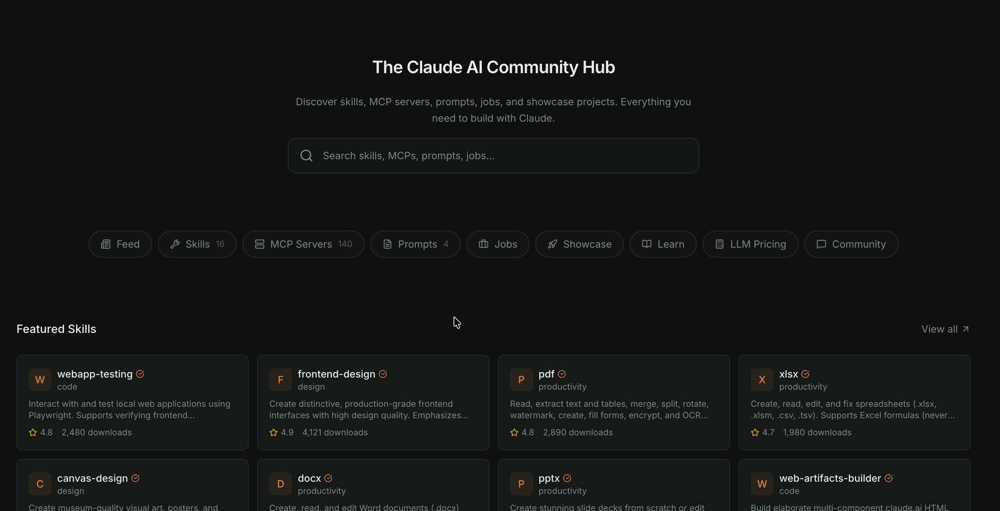

# Claude Collective Frontend

Discover skills, MCP servers, prompts, jobs, and showcase projects. Everything you need to build with Claude.



## Getting Started

### Prerequisites

Ensure you have Node.js 18.17.0+ installed. This project uses `npm` for package management.

### Running Development Server

```bash
npm run dev
```

Open [http://localhost:3000](http://localhost:3000) with your browser to see the result.

---

## Production Deployment

### Architecture
- **Frontend**: Next.js in Docker on port `3000`
- **Domain**: `claudeai.directory` → nginx (host) → Next.js (port 3000)
- **API**: `https://api.claudeai.directory/api` (see `server/` repo)

### First-time setup
```bash
# 1. Copy env and fill in real values
cp .env.production .env
# Edit .env — set NEXT_PUBLIC_API_URL=https://api.claudeai.directory/api

# 2. Start the frontend container
docker compose up -d --build

# 3. Set up domain + SSL (requires DNS A record pointing to this server)
sudo bash setup-domain.sh
```

### DNS records required
| Type | Name | Value |
|------|------|-------|
| A | `@` | `<server-ip>` |
| A | `www` | `<server-ip>` |

---

## Restart Commands (Production)

### After a code change or `.env` change
`NEXT_PUBLIC_*` vars are baked in at **build time** — always use `--build`:
```bash
docker compose up -d --build
```

### Restart without rebuilding
```bash
docker compose restart frontend
```

### Full stop and start
```bash
docker compose down
docker compose up -d
```

---

## Diagnostics

### Check container status
```bash
docker compose ps
```

### View live logs
```bash
docker compose logs -f --tail=50
```

### Test app is responding
```bash
curl http://127.0.0.1:3000
```

### Test HTTPS end-to-end
```bash
curl -I https://claudeai.directory
```

### Check nginx
```bash
systemctl status nginx
sudo nginx -t               # validate config
sudo systemctl reload nginx
sudo tail -f /var/log/nginx/error.log
```

### Check SSL cert expiry
```bash
sudo certbot certificates
```

---

## Common Issues

### API calls fail / Mixed Content error
`.env` has wrong API URL. Check and fix:
```bash
grep NEXT_PUBLIC_API_URL .env
# Must be: NEXT_PUBLIC_API_URL=https://api.claudeai.directory/api
docker compose up -d --build
```

### Code changes not appearing after deploy
`NEXT_PUBLIC_*` env vars require a rebuild:
```bash
docker compose up -d --build
```

### nginx 502 Bad Gateway
Frontend container is not running:
```bash
docker compose ps
docker compose up -d
```

### SSL cert issues
```bash
sudo certbot renew --dry-run
sudo systemctl status certbot.timer
```

---

## Tech Stack & Features

-   **Framework**: [Next.js 15](https://nextjs.org/) (App Router, Server Actions)
-   **Styling**: [Tailwind CSS v4](https://tailwindcss.com/)
-   **UI Library**: [Radix UI](https://www.radix-ui.com/) primitives
-   **Components**: Based on [shadcn/ui](https://ui.shadcn.com/) patterns
-   **Icons**: [Lucide React](https://lucide.dev/)
-   **State Management**: React Query (TanStack Query) / Context API
-   **Forms**: React Hook Form + Zod validation

## Claude AI Directory Features

- **MCP Servers Directory**: Discover and share Model Context Protocol servers to extend Claude's capabilities.
- **Prompts Library**: A collection of optimized system prompts and user prompts for various use cases.
- **Skills & Capabilities**: Explore agentic skills that allow Claude to interact with external tools and APIs.
- **Showcase Projects**: See what the community is building with Claude and get inspiration.
- **Job Board**: Find the latest opportunities in the AI and LLM space.
- **Learning Resources**: Guides, tutorials, and documentation to help you master Claude.
- **Community Submission**: Easily submit your own resources, projects, and findings to the directory. 


